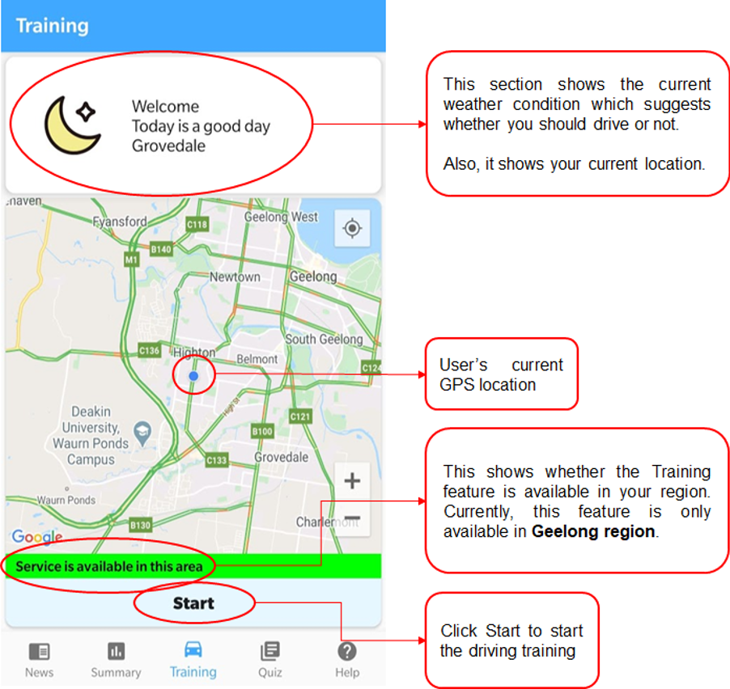
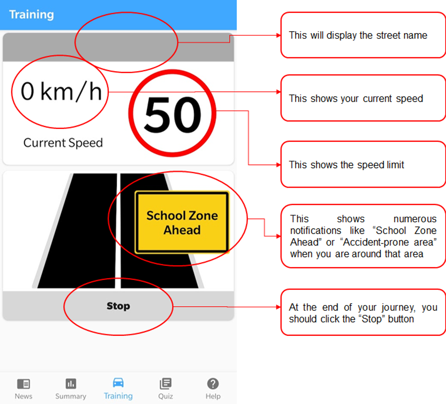
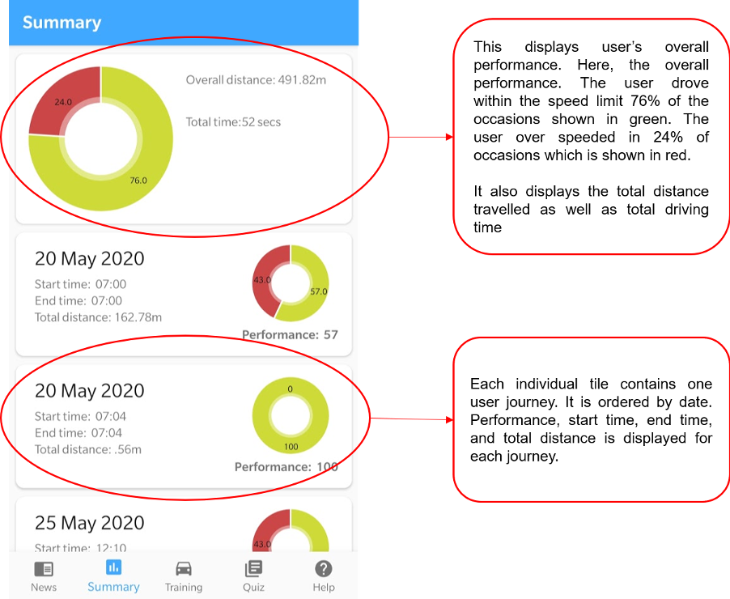
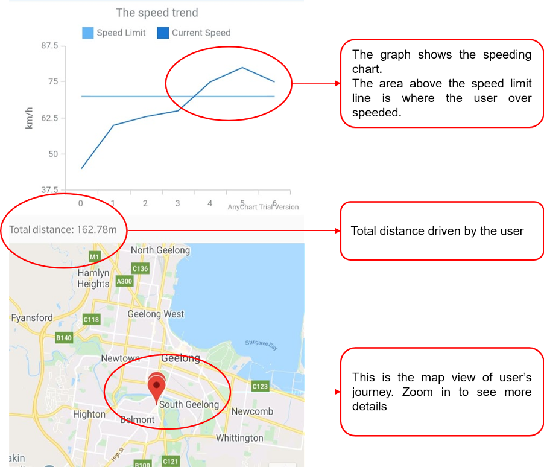
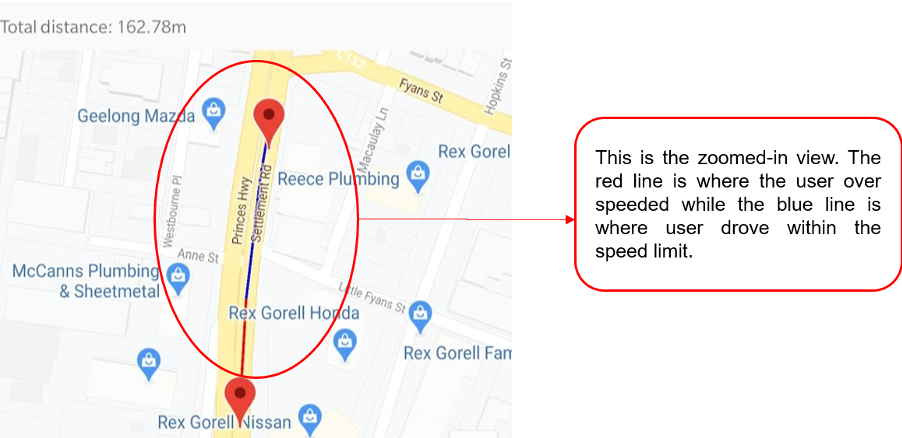
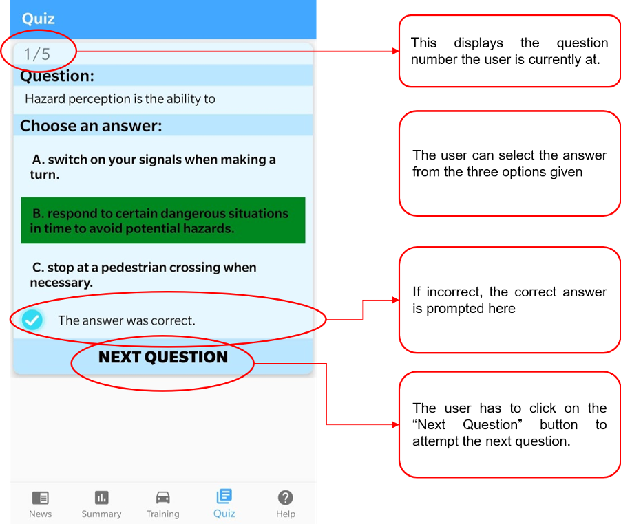
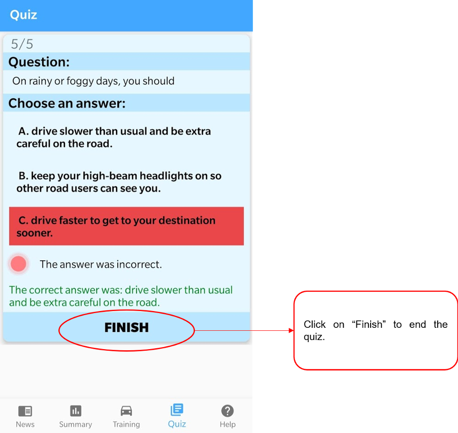

# Rural Essential

这个 app 主要用意是为了通过教育年轻司机的方式去减少交通事故和伤亡 功能主要分为以下几块：

### 首页

- 首页天气提醒 用户可以看到当前天气并会有建议是否适合驾驶出行

- 当用户点击 start 后 会进入驾驶页面 屏幕会显示其当前速度和道路限速 如有学校区域也会显示 若超速 则会有语音提示

- 用户点击 stop 后 他的记录就会被记录下来 并可以再 summary 界面查看他的总表现和 每次出行的表现

- 点击某个选项卡 进入详情界面 此处可以看到用户的 速度曲线和限速曲线 用户也可以看到自己实际地图上的行进路线

- 当用户放大地图可以看到自己在那一段路上超速 因此可以再下一次出行的时候注意

- 新闻界面 用户可以看到当前实时新闻 点击选项卡可以进入新闻详情界面

- 用户可以进行自我小测试 来看是否对交通常识问题有清晰认知

